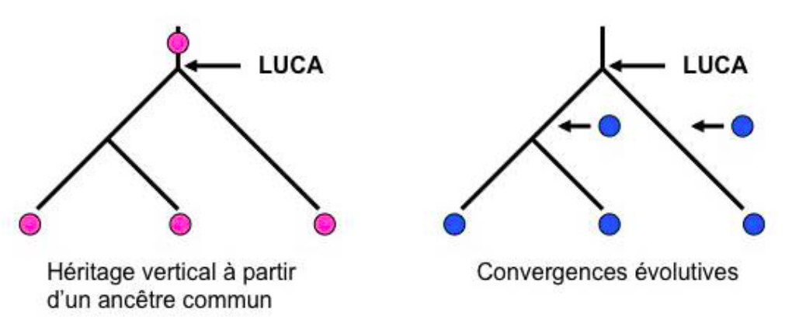

# LUCA, QUI ÉTAIT-IL ? 

LUCA *(Last Universal Common Ancestor)* est notre dernier ancêtre commun universel, il possède des caractères communs avec tous les êtres vivants.

LUCA est apparu il y a environ 2,8 Ga. LUCA n'est pas la première cellule apparue sur Terre mais la plus proche de tous les êtres vivants actuels.

LUCA est un être théorique, on ne peut que supposer ses caractères. Dès lors, que pouvons-nous dire sur LUCA ?

Dans un premier temps, nous verrons que LUCA est notre ancêtre à tous, puis nous étudierons l'époque à laquelle il a vécu et nous finirons par le décrire.

## Comment prouver que LUCA est notre ancêtre à tous ? 

De nos jours, les progrès de la biologie moléculaire ont permis de montrer que les êtres vivants actuels partagent un certain nombre de caractères.

Certains de ces caractères sont communs à tous les êtres vivants comme par exemple l'ADN, l'organisation cellulaire.

L'apparition de ces caractères dans chacune des 3 branches du vivant (Bactérie, Archée, Eucaryote) n'a pas pu se faire de manières identiques dans les 3 branches en même temps, ces caractères ont forcément été hérités d'un ancêtre commun.

## Quand a t-il vécu? 

LUCA étant un organisme vivant, il est postérieur à l'origine de la vie. La vie est apparue il y a au moins 2,8 milliards d'années, il est donc très difficile d'avancer une date précise sur l'âge de LUCA.

En effet, plus on remonte dans le temps, plus les traces de vie anciennes sont rares et difficiles à analyser.

Même si des organismes avaient vécu à cette époque, il serait très difficile de déterminer s'il s'agit de LUCA, de ses ancêtres ou de ses descendants.

LUCA a certainement vécu avant l'oxygénation de l'atmosphère sous l'effet de l'activité photosynthétique des bactéries. Ce sont des bactéries, c'est à -dire des descendants de LUCA.

## Sa carte d'identité

LUCA possède forcément certains caractères qu'il a légué à sa descendance :

\-    La cellule

\-    l'ADN

\-    La machinerie cellulaire

 

LUCA est un être théorique, nous ne pouvons pas être précis à son sujet, mais nous savons qu’en tant que dernier ancêtre commun il partage certains caractères les êtres vivant actuel. Nous ignorons toujours s’il était eucaryote ou procaryotes.

Son âge est encore incertain mais les découvertes futures permettront surement d’en connaître plus à propos de nos origines communes.