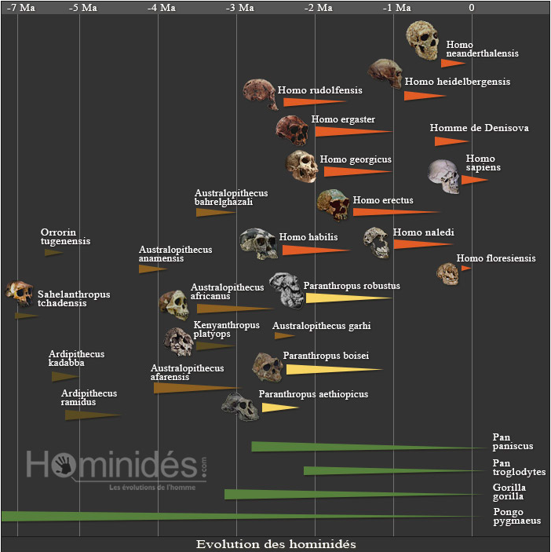
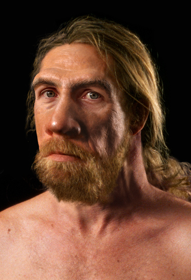
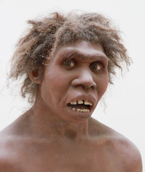
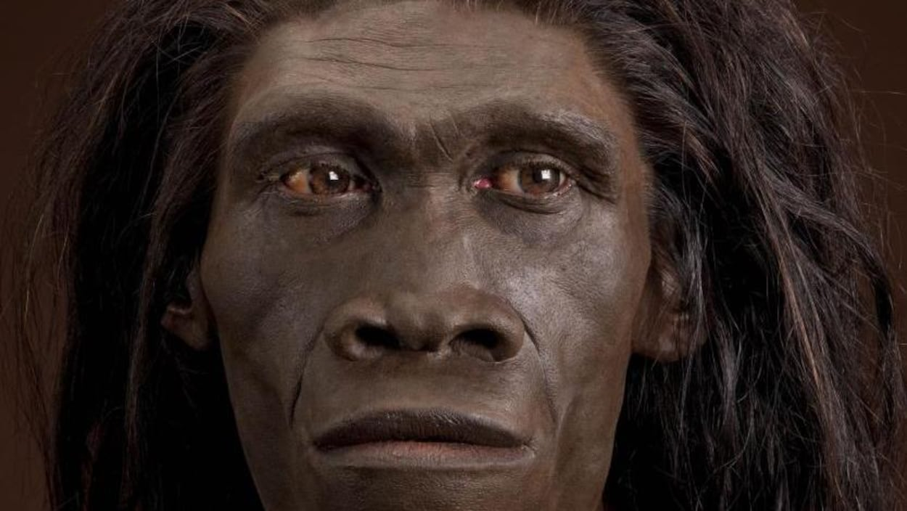
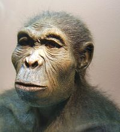

# La lignée humaine

La « lignée humaine » représente toute l’histoire évolutive des Homininés à partir du plus récent
ancêtre commun à l’Homme et au Chimpanzé. 

## L'Homme parmi les êtres vivants

Nous sommes un **eucaryote** et un **Vertébré** **Tétrapode**.Nous sommes des **Mammifères**.

L'Homme un *primate* de la famille des <u>Homininés</u> (2 genres Australopithèque et *Homo*). Certains
scientifiques incluent les Chimpanzés et les Bonobos. 

## Les représentants de la lignée humaine

La lignée humaine regroupe le genre *Homo* et tous les genres fossiles ayant une parenté plus proche avec les humains qu'avec les chimpanzés, espèce actuelle la plus proche de l'Homme.

Le genre *Australopithèque* apparait en Afrique il y a environ 4,2 millions d'années. Huit espèces d'australopithèques ont déjà été décrites à ce jour. Ce genre semble céder ensuite la place aux *Paranthropes*, dont trois espèces sont connues, mais qui s'éteignent en Afrique avant 1 million d'années.

Voici une présentation de 5 représentants : 

### *Homo neanderthalensis*

Si de manière globale la morphologie de Néandertal est semblable à celle d'*Homo sapiens*, il existe de nombreuses différences si l'on compare les squelettes des deux espèces. Pour Néandertal, plus trapu, la cage thoracique est évasée, l'avant bras est de même taille que le bras, les membre inférieurs sont plus courts. 

Sa capacité crânienne évolue de *1500 à 1750 cm^3^*, supérieure à celle de l'*Homo sapiens* mais il est plus petit (en taille) que lui...

#### Régime alimentaire

Si l'étude de sa dentition et de ses mâchoires montre un régime alimentaire à base de viande, les découvertes se succédent pour enrichir son menu.
On découvre ainsi que Néandertal mangeait des coquillages,des mollusques, des phoques, des végétaux et de petits mammifères.

#### Culture

De nombreux outils on été retrouvés dans l'environnement de *Neanderthalensis* : racloirs, pointes... issus d'éclats de silex retravaillés.
A noter, de nombreux fossiles ont été trouvés dans une posture et dans un lieu qui démontrent que ces humains **inhumaient** leurs morts.

Contemporain de l'*Homo sapiens*, Neanderthal n'était ni son ancêtre, ni son descendant... ce sont deux espèces bien distinctes.

### *Homo ergaster*

Par sa silhouette, l'*Homo ergaster* ressemble à l'homme moderne. Tous les spécimens retrouvés sont de grande taille (1.70m). L'étude de ses membres inférieurs indique qu'il était non seulement un bipède accompli mais certainement un excellent marcheur capable de courir sur de longues distances.

Sa capacité crânienne de l'ordre de 850 cm3 est certes plus petite que celle d'*Homo sapiens*, mais assez importante vis-àvis de ses contemporains.

### *Homo erectus*

*Homo erectus* est doté d'un squelette hyperossifié et massif.

Avec un volume cérébral compris entre 850 et 1100 cm^3^, c'est **le premier hominidé** **qui dépasse les 1000 cm^3^** ( à comparer à nos 1350 cm^3^ actuels, en moyenne).
Les parois latérales du crâne se rapprochent vers le haut et donne à l'ensemble une forme spécifique.

Le dimorphisme sexuel est réduit (autrement dit il y a peu de différence physique entre le mâle et la femelle).

Les Homo erectus maîtrisaient la taille de la pierre.

Ce sont également les premiers hominidés qui ont **maîtrisé le feu**. 

Par ailleurs *Homo erectus* est le premier hominidé à migrer hors d'Afrique. Ce ne sont pas des exodes de masses mais plutôt de petits groupes de chasseurs qui partent vers le Nord, probablement en suivant des troupeaux d'animaux. On retrouve donc des restes fossiles d'*Homo erectus* en Europe et en Asie.

### *Homo habilis*

La **bipédie** d'*habilis* est favorisée par des membres inférieurs plus robustes et des membres supérieurs plus légers. Toutefois il devait également utiliser son aptitude à grimper dans les arbres pour se déplacer.

Sa **capacité crânienne** allait de de 550 à 680 cm3.
Doté d'incisives développées et de canines réduites *Homo habilis* était **omnivore**, on suppose qu'il n'était pas chasseur mais plutôt charognard.
L'aire de Broca (dans le cerveau), développée, peut amener à penser que l'*Homo habilis* utilisait un **langage articulé** pour s'exprimer...

Contrairement à ce que laisse supposer son nom (*habilis*), la morphologie de ses mains ne le rend pas plus apte à utiliser des outils que ses contemporains.
Homo habilis devait vivre entre 30 et 40 ans.

### *Homo sapiens*

<figure> <figcaption>Rosalind Franklin </figcaption></figure>

Le plus ancien fossile d'*Homo sapiens* a été retrouvé en 2017 sur le site du Jbel Irhoud au Maroc : les squelettes et restes de crânes de 5 individus ont été découverts et étudiés.

Sa capacité crânienne s'est modifiée... passant de 1100 cm^3^ pour les premiers sapiens à 1 650 cm^3^ il y a 40 000 ans pour "se retrouver" à **1400 cm^3^ **actuellement.

Constructeur d'outils de plus en plus perfectionnés (souvent des **armes**), il s'est aussi lancé dans la création artistique et nous a laissé de nombreuses **fresques** (comme Chauvet ou Lascaux).

Peu après l'arrivée des *Homo sapiens* en Europe, les Néanderthaliens ont disparu. Sans pour l'accuser formellement, il est possible qu'*Homo sapiens* soit l'une des cause de son extinction. Par ailleurs on a retrouvés dans le génome individuel des *Homo sapiens* 3% de celui des néandertaliens.

*Source : hominides.com*