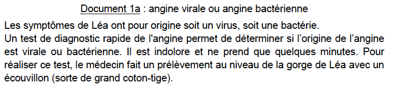
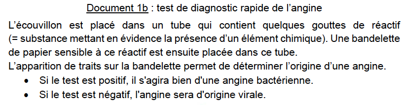
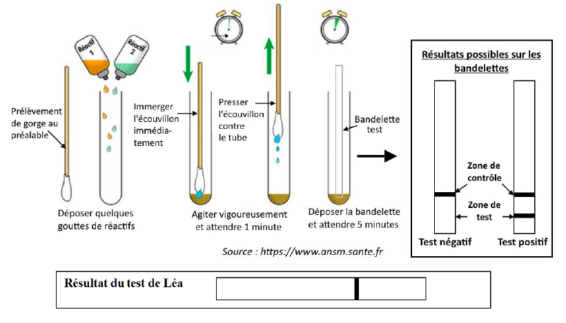
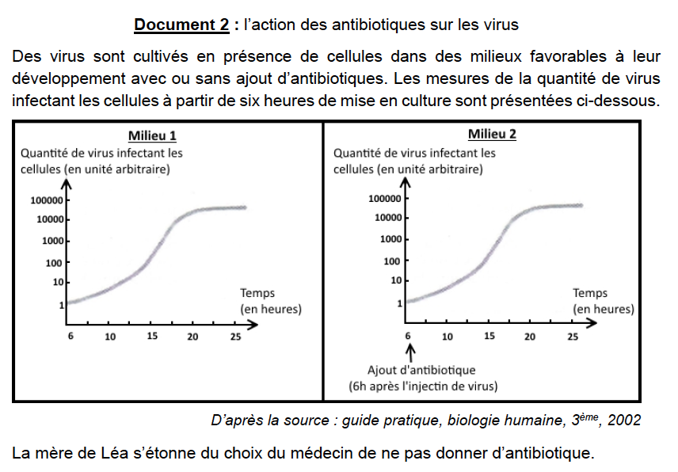
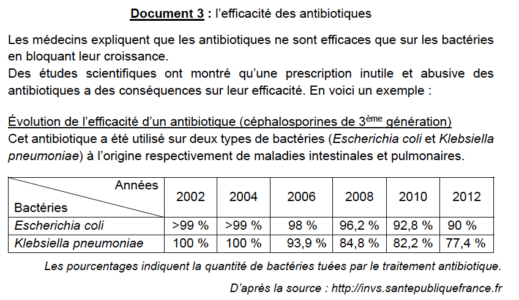

# DNB blanc 

## Sujet

[Cliquez ici pour télécharger le sujet en pdf.](../Img/DNB/Sujet.pdf)

## Correction

Léa a 14 ans. Elle souffre de maux de gorge, a du mal à avaler et a de la fièvre. Sa mère décide de consulter un médecin pour obtenir des antibiotiques. Le médecin diagnostique une angine provoquée par un microorganisme responsable des douleurs de Léa. Il lui indique qu’il doit effectuer des examens complémentaires car les antibiotiques ne sont pas donnés automatiquement.

### Question 1 (4 points) : d’après vos connaissances, cocher la bonne réponse pour chaque proposition.

1.1. Les bactéries sont :

[x] **des êtres vivants observables au microscope,** 
[ ] des êtres vivants visibles à l’oeil nu, 
[ ] des êtres vivants observables à la loupe. 

> *En effet, ce sont des microorganisme, elles sont donc uniquement visible au microscope.*

1.2. Les bactéries sont :

[ ] toutes pathogènes, 
[x] **ne rendent pas forcément malades,** 
[ ] entraînent toujours la mort. 

> *Une bactérie n'est pas forcément pathogène, et même si elle l'est, ce n'est pas forcément mortel.*

1.3. On rencontre des microorganismes :

[x] **dans tous les milieux,** 
[ ] seulement dans l’air et dans l’eau, 
[ ] seulement à l'intérieur des organismes vivants. 

> *C'est ce qu'on appelle l'ubiquité des microorganismes.*

1.4. La contamination est :

[ ] la défense de l’organisme contre les microorganismes, 
[ ] la multiplication des microorganismes dans l’organisme, 
[x] **la pénétration des microorganismes dans l’organisme.** 

> *La contamination n'est pas à confondre avec l'infection*

### Question 2 (6 points) : à l’aide du document 1, déterminer l’origine de l’angine de Léa en justifiant.

> Ici les documents 1a et 1b nous renseigne seulement sur l'origine de ce test, en effet, le medecon a besoin de savoir s'il s'agit d'une angine **virale** ou **bactérienne**. 
>
> La procédure de test est détaillé dans le document 1.

Léa est malade, elle a une angine, son medecin cherche à savoir s'il s'agit d'une **angine bactérienne** ou **virale**. Pour cela il réalise un test détaillé dans le document 1. 

Ce test se présente sous forme de bandelette, si celle ci présente **2 bandes**, le test est **positif**, si il n'y a qu'**une bande** le test est **négatif**. 

Un test **positif** signifie qu'il s'agit une angine **bactérienne**.

Sur le résultat du test de Léa, il n'y a qu'une seule bande, donc son test est **négatif**. En conclusion, Léa est atteinte d'une **angine virale.**

### Question 3 (6 points) : en utilisant des données extraites uniquement du document 2, justifier le choix du médecin.

> Le medecin ne veut pas donner d'antibiotique à Léa. 

> L'unité arbitraire (ua) est une unité donné à titre indicatif, ici on peut dire qu'entre 10 ua et 100 ua, il y a 10 fois plus de virus. 

L'expérience porte sur la culture de virus dans deux mileux nutritifs identiques, le milieu 1 est le **témoin**, sans **antibiotiques**, alors que dans le milieu 2, on ajoute à 6h de l'expérience des **antibiotiques**. 

Après 25 h d'expérience, que ce soit dans le milieu 1 ou le milieu 2, on observe la même quantité de virus, environ 10 000 ua. J'en déduis que l'ajout d'antibiotique **n'a rien modifié quant à la multiplication du virus dans le milieu**, donc les **antibiotiques sont sans effet sur les virus.**

C'est pour cela que le medecin ne prescrit pas d'antibiotiques à Léa, ceux-ci seraient **inefficaces** contre l'angine virale de Léa. 

### Question 4 (9 points) : à l'aide de l’ensemble des documents, reconstituer le raisonnement suivi par le médecin permettant d’expliquer pourquoi, dans le cas de l’angine de Léa, il a choisi de ne pas prescrire d’antibiotique.

> *Même si la question ne porte pas directement sur le document 3, il est indispensable de l'analyser pour répondre correctement à la question. Cette analyse peut être faite au brouillon.*

Léa a de la fièvre, c'est signe d'une réponse de son **système immunitaire**, elle a une **infection.**

Le médecin pense a une angine, mais il ne peux pas prescrire des antibiotiques automatiquement, il doit pour cela faire un test (*Document 1*). Ce test permet de connaitre le type de maladie, dans le cas de Léa, il s'agit d'une **angine virale**. 

Grace au *Document 2*, nous savons que les antibiotiques ne sont pas efficaces sur les virus, il n'est donc pas nécéssaire d'en prescrire à Léa. 

De plus, nous apprenons grâce au *Document 3*, qu'en plus de n'avoir **aucun effet sur les virus**, les antibiotiques, prescrits sans nécessité ou de façon abusive, induisent une **résistance des bactéries aux antibiotiques**, c'est à dire que les antibiotiques seront de moins en moins efficaces.

Pour conclure, le medecin de Léa ne lui prescrit pas d'antibiotiques, car premièrement, cela n'aura aucun effet sur sa maladie, et deuxièmement, si leurs utilisations n'est pas adaptée, cela induit une **résistance** des bactéries, ce qui pourrait **diminuer** l'efficacité de l'antibiotique, cela représente un danger si un jour Léa attrape une infection bactérienne et a besoin de ces antibiotiques pour se soigner.  

