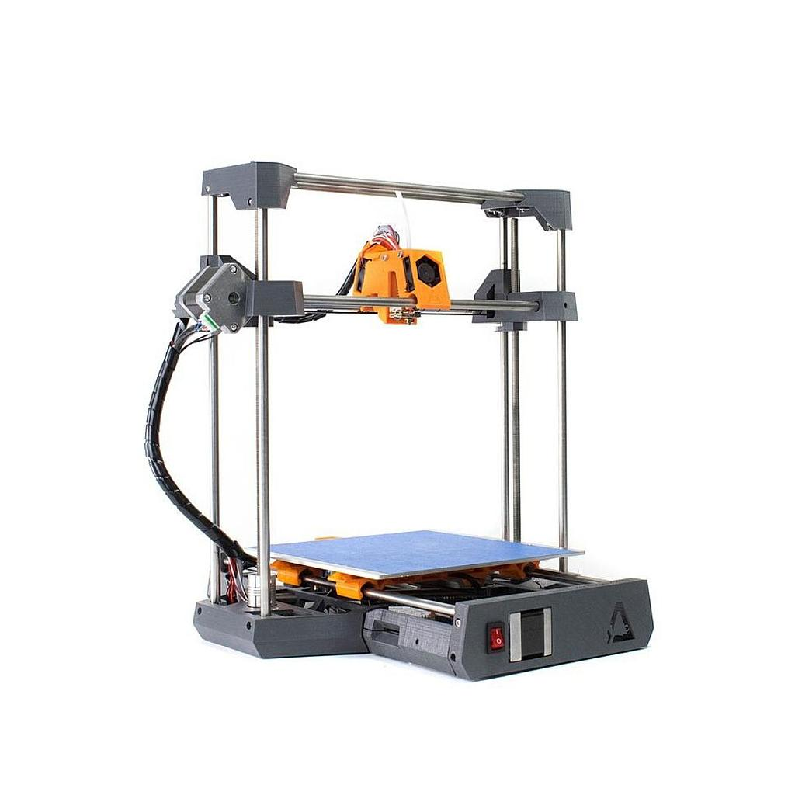

# L'impression 3D, tout une histoire ! 

Il y a maintenant quelques années, le monde de l'impression 3D s'est ouvert à moi, pour vous situer cela dans le temps, c'est au moment de la sortie de la Dagoma Discoeasy 200, première du nom ! 

Avant de vous raconter des tas de choses sur mon expérience sur l'impression 3D, il faut faire un peit morceau de cours ! 

## C'est quoi l'impression 3D ? 

L'impression 3D est une technologie, d'**impression** en **3 dimensions**... je sais c'est impressionnant comme connaissance. 

Il en existe plusieurs types, je ne vais pas vous parler de tout ce qui existe, mais de 3 types en particuler : 
* les imprimantes 3 axes (cartésienne et core XY)
* les imprimantes delta
* les imprimantes résine

### Imprimantes 3 axes

Comme le nom l'indique, ces imprimantes vont imprimer les pices couches par couches selon des coordonées X / Y et Z, il y a donc 3 axes qui bougent. 

Une imprimante **cartésienne** aura 1 moteur par axes de déplacement, alros qu'une **Core XY** utilisera 2 moteurs en simultanée pour bouger l'axe X et Y (le cas de l'Hypercube) 

!!! les deux types d'imprimantes ont des fonctionnement très différents, il faut donc se renseinger avant d'en prenre une, mais il y a une page dédié pour cela

### Imprimantes Delta

Ici, pas de coordonées X/Y/Z mais des coordonnées polaires, l'idée est la même, ça imprime couche par couche, mais avec une mode de coordonnées différentes. 

### Imprimantes résines

Rapidement, c'est assez simple, un laser UV va frapper une résine, qui va polymériser et donc se solidier à un endroit, et couche par couche, nous pouvons imprimer un objet. 

## Et donc ?

Alors pourquoi parler de ces types d'imprimantes ? Simplement car mon but est d'en avoir une de chaque type ! J'ai déjà une cartésienne, et je suis en cours d'assemblage d'une Core X/Y.

Pour en savoir plus, je vous laisse parcourir les pages de la section **Geek**